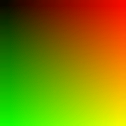
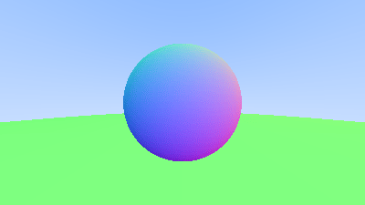
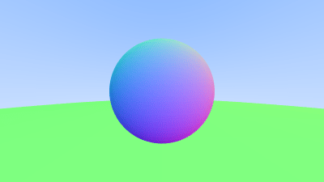
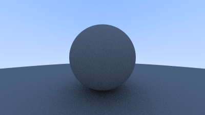
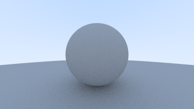
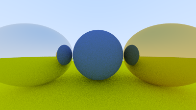
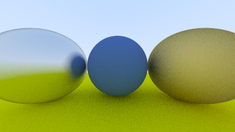
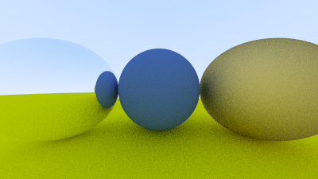
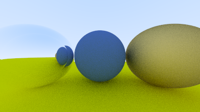

## [Ray Tracing in One Weekend](https://github.com/gmath45/Graphics-Programming/RayTracerInOneWeekend)

---

I had been going back-and-forth as to what book or project I should start showcasing, so I've decided on starting this one! ([Ray Tracing in One Weekend - Peter Shirley, Trevor David Black, Steve Hollasch](https://raytracing.github.io/books/RayTracingInOneWeekend.html))

### Tools:
 - C++11
 - CMake

### Files:
> #### [Hello Color](PPMs/image.ppm):
> ---
> - `color.h`
> - `ray.h`
> - `vec3.h`
> - `main.cpp` \
> 
> 

> #### [Blue & White 'Sky'](PPMs/sky.ppm):
> ---
> - `color.h`
> - `ray.h`
> - `vec3.h`
> - `main.cpp` \
> 
> 

> #### [Red Sphere (Unshaded)](PPMs/sphere.ppm):
> ---
> - `color.h`
> - `ray.h`
> - `vec3.h`
> - `sphere.cpp` \
> 
> [")](PPMs/sphere.ppm)

> #### [Red Sphere (Shaded)](PPMs/sphere_shaded.ppm):
> ---
> - `color.h`
> - `ray.h`
> - `vec3.h`
> - `sphere_shaded.cpp` \
>
> [")](PPMs/sphere_shaded.ppm)

> #### [Hittable](PPMs/hittable.ppm):
> ---
> - `hittable.h`
> - `hittable_list.h`
> - `rtweekend.h`
> - `sphere.h`
> - `hittable.cpp` \
> 
> 

> #### [Camera](PPMs/camera.ppm):
> ---
> Same picture but form the 'view' of the `Camera()`
> - `camera.h`
> - `camera.cpp` \
> 
> 

> #### [Square Anti-Aliasing](PPMs/square_aa.ppm):
> ---
> - `interval.h`
> - `square_aa.cpp`: Implement AA \
> 
> 

> #### [Diffuse Material](PPMs/diffuse_1.ppm):
> ---
> - `camera.h`: 
>   - apply Lambertian Diffuse to `ray_color()`
>   - implement `max_depth` to prevent Stack Overflow
> - `vec3.h`: 
>   - Implemented random Vec3
> - `diffuse_1.cpp`
> 
> 

> #### [Gamma Correction](PPMs/gamma_1.ppm):
> ---
> - `color.h`:
>   - Convert to gamma-space `linear_to_gamma()`
> - `gamma_1.cpp`
> 
> 

> #### [Metal Material](PPMs/metal.ppm): ( hover image for Named Differences)
> ---
> - `camera.h`:
>   - Modified `ray_color()` with `material.h` classes
> - `material.h`:
>   - Added `material`, `lambertian` & `metal` classes
> - `sphere.h`:
>   - Initialized `mat` pointer
> - `vec3.h`:
>   - Added `reflect()` for Vec3s and Normals
> - `metal.cpp`
> 
>> some of these don't look like much has changed, but that is because the detailing is to small to notice (verified with `diff editor` in Hex)
>
>  
 
 

> #### [Positionable Camera](PPMs/positional_cam.ppm):
> ---
> - `positionable_cam.cpp`:
> 
> 

---

